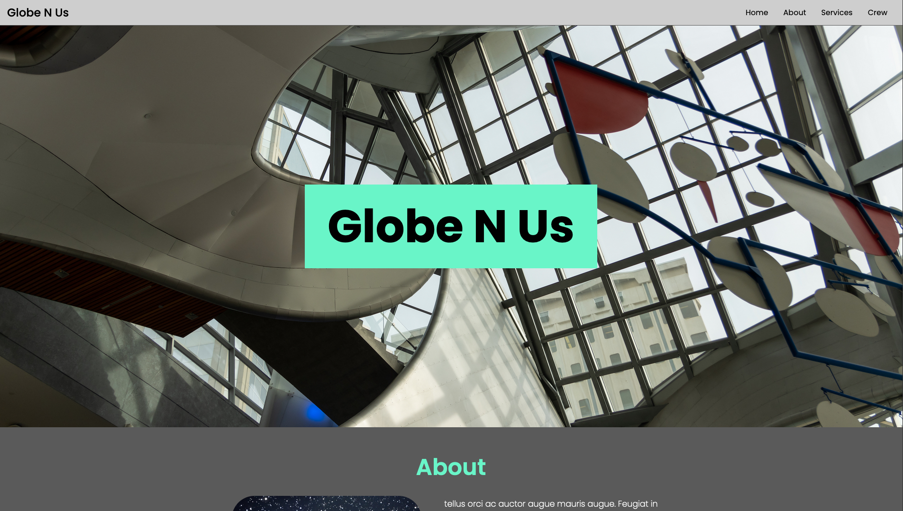
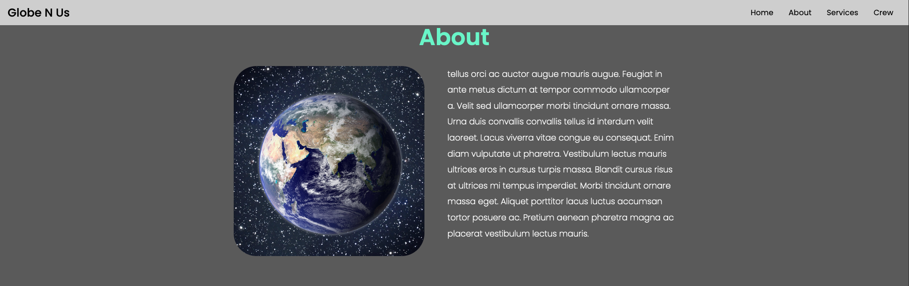
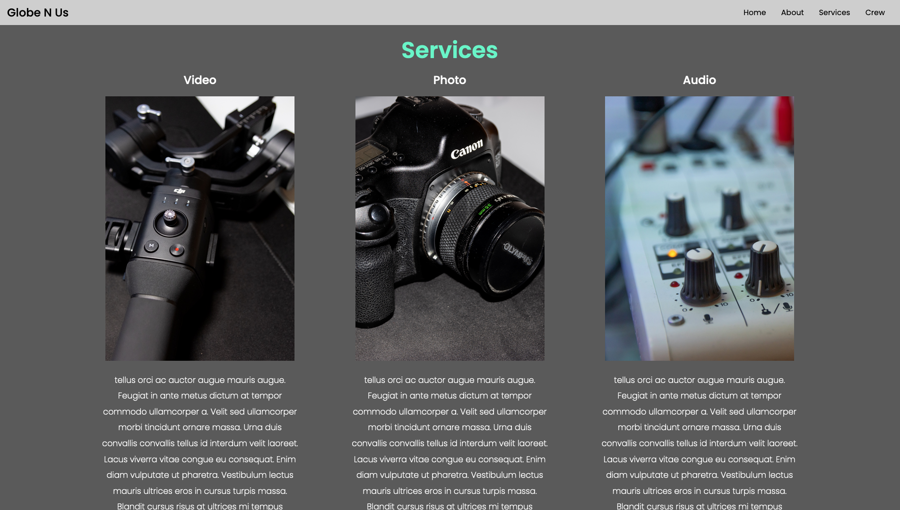
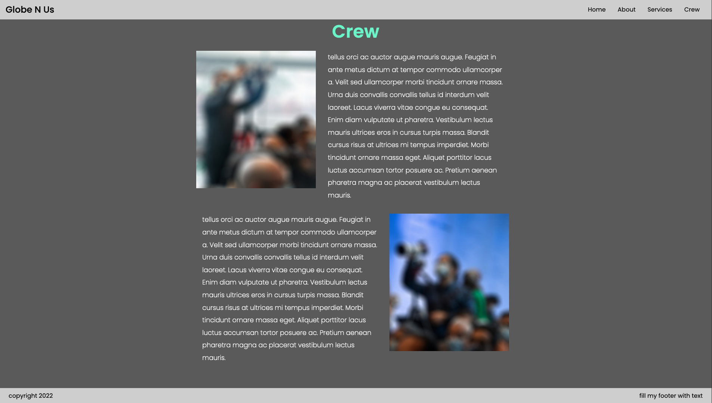

# Company Home Page with Flexbox

This is was a codecademy project that required me to create a web page for a
company, real or imaginary. It was open ended and required that it have a landing
section, services and that I use flexbox to create the layout. 
I chose to use a real company Globe N Us becuase I had assets for it already.
This was created using only CSS and HTML
